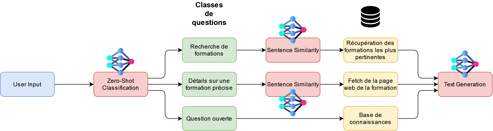

# StudyMate
Ce repository contient le serveur et l'IA mise en place pour le projet de fin d'année ICY 4A de l'INSA Hauts-de-France.

## Overview

### Serveur
 - wsgi.py : lance le serveur. Doit être configuré avec systemctl.
 - server_handle : contient toutes les fonctions de communication de sockets.
 - test_client : lance un client afin de pouvoir tester la communication avec le serveur et un utilisateur.

### IA
- edubot : contient le code permettant au chatbot de générer du texte et de gérer son historique.
- pipeline : pipeline de notre projet, voir image ci-dessous.

Le dossier `utils` contient tous les fichiers utiles permettant aux fichiers ci-dessus de s'exécuter, ainsi que le prompt donné à Vigogne.
